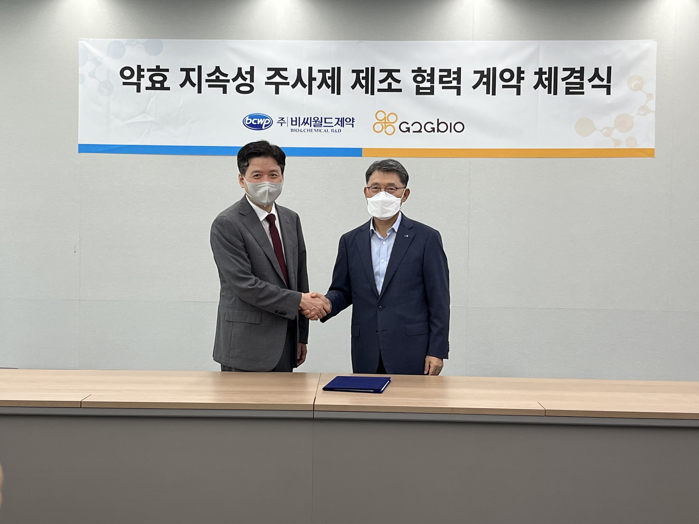

G2GBIO 페이지를 HTML, CSS, Javascript, Jquery, GSAP, SWIPER를 사용하여 
Clone-Coding으로 구현한 웹페이지입니다.

---

# **주요 효과 및 내용 정리**

### 1. **GSAP ScrollTrigger 플러그인 설정**

- *GSAP(그린소프트 애니메이션 플랫폼)**의 **ScrollTrigger**를 사용하여 스크롤에 반응하는 애니메이션을 구현합니다.

```
gsap.registerPlugin(ScrollTrigger);

```

- **목적**: 스크롤을 기준으로 애니메이션 효과를 트리거합니다.
- **주요 기능**:
    - 페이지 내 특정 위치에서 애니메이션 시작/끝을 지정합니다.

---

### 2. **주요 요소 선택 및 변수 설정**

페이지의 주요 요소들을 선택해 변수에 할당합니다. 이후 이 요소들을 이용해 다양한 효과를 추가합니다.

```
const pageScrollWrap = document.querySelector('.page-scroll-wrap');
const header = document.querySelector('header');
const hdNavBtn = document.querySelector('.hd-nav-btn');
const gnbWrap = document.querySelector('.gnb');
const gnbList = document.querySelectorAll('.gnb>li');
const lnbList = document.querySelectorAll('.lnb');

```

- **목적**: 스크롤, 메뉴, 버튼 등 다양한 DOM 요소를 선택하여 제어합니다.

---

### 3. **네비게이션 메뉴 효과**

### 3.1. **메인 메뉴 Hover**

메인 메뉴 항목에 마우스를 올리면 서브 메뉴가 **부드럽게 나타나도록** 처리합니다.

```
gnbList.forEach((gnb, i) => {
  gnb.addEventListener('mouseenter', () => {
    // 서브 메뉴 보이기
    const targetLnb = document.querySelector(`.lnb.sub${i + 1}`);
    if (targetLnb) {
      targetLnb.style.display = 'block';
      gsap.fromTo(targetLnb.querySelector('.dep2'), {
        opacity: 0,
        x: '1rem',
      }, {
        x: 0,
        opacity: 1,
        duration: 0.4,
        ease: 'power1.inOut'
      });
    }
  });
});

```

- **애니메이션**: 서브 메뉴의 요소들이 **x축으로 이동하며** 서서히 나타납니다.

### 3.2. **메뉴 밖으로 마우스 이동 시 서브 메뉴 닫기**

```
gnbWrap.addEventListener('mouseleave', () => {
  lnbList.forEach((lnb) => lnb.style.display = 'none');
});

```

- **목적**: 마우스가 메뉴 밖으로 나가면 서브 메뉴를 숨깁니다.

---

### 4. **부드러운 스크롤 구현**

**LocomotiveScroll**을 이용해 스크롤을 부드럽게 처리합니다. 이를 통해 데스크탑과 모바일에서 **스무스한 스크롤** 효과를 제공합니다.

```
const locomoScroll = new LocomotiveScroll({
  el: pageScrollWrap,
  smooth: true,
  smoothMobile: true,
  paused: true,
});

```

- **목적**: 부드러운 스크롤을 적용하여 사용자 경험을 개선합니다.
- **옵션**:
    - `smooth`: 부드러운 스크롤을 활성화
    - `paused`: 초기 상태에서 스크롤을 일시정지하고, 필요시 수동으로 시작

---

### 5. **ScrollTrigger와 LocomotiveScroll 연결**

두 스크롤 시스템을 연결하여, **LocomotiveScroll**의 스크롤 이벤트를 **ScrollTrigger**가 인식할 수 있도록 합니다.

```
ScrollTrigger.scrollerProxy(pageScrollWrap, {
  scrollTop(value) {
    if (arguments.length) return locomoScroll.scrollTo(value, 0, 0);
    return locomoScroll.scroll.instance.scroll.y;
  },
  getBoundingClientRect() {
    return { top: 0, left: 0, width: window.innerWidth, height: window.innerHeight };
  }
});

```

- **목적**: LocomotiveScroll을 ScrollTrigger와 연결해, 스크롤 이벤트가 두 시스템에 맞게 동기화됩니다.

---

### 6. **Hero 영역 애니메이션**

Hero 섹션에서 스크롤 시, **opacity** 값을 조정하여 페이지가 스크롤됨에 따라 점차 **사라지도록** 설정합니다.

```
gsap.to('.hero', {
  scrollTrigger: {
    trigger: pageScrollWrap,
    scroller: pageScrollWrap,
    scrub: true,
    start: "+=2%",
    end: "+=70%"
  },
  opacity: 0
});

```

- **목적**: 페이지 스크롤에 따라 Hero 영역을 점차적으로 **투명하게** 만들어 사용자에게 몰입감을 주는 효과를 만듭니다.

---

### 7. **헤더 스타일 변경**

스크롤의 방향에 따라 헤더에 클래스를 추가/제거하여 **스타일을 변화**시킵니다.

```
locomoScroll.on('scroll', (position) => {
  if (position.delta.y > 0) {
    header.classList.add('isScroll');
  } else {
    header.classList.remove('isScroll');
  }
});

```

- **목적**: 헤더가 스크롤 방향에 따라 **상단 고정** 및 **배경 색상 변경** 효과를 적용합니다.

---

### 8. **슬라이더 제어 (Hero 슬라이더)**

`Swiper` 라이브러리를 사용해 Hero 섹션의 슬라이더를 제어합니다. **자동 재생** 및 **이동**이 가능합니다.

```
const heroSlider = new Swiper(".hero-slider", {
  effect: 'fade',
  speed: 1000,
  autoplay: {
    delay: 5000,
    disableOnInteraction: false
  },
  loop: true,
  navigation: {
    nextEl: '.hero-arr.right',
    prevEl: '.hero-arr.left'
  }
});

```

- **목적**: 슬라이더의 자동 재생과 이동 버튼을 설정합니다.

---

### 9. **슬라이더 재생/정지 버튼**

슬라이더의 재생/정지 버튼을 클릭하면 슬라이더가 **정지**하거나 **재개**됩니다.

```
heroSlStopBtn.addEventListener('click', function () {
  fadeOut(this);
  fadeIn(heroSlPlayBtn);
  heroSlider.autoplay.stop();
});
heroSlPlayBtn.addEventListener('click', function () {
  fadeOut(this);
  fadeIn(heroSlStopBtn);
  heroSlider.autoplay.start();
});

```

- **목적**: 사용자가 **슬라이더의 자동 재생**을 제어할 수 있도록 합니다.

---

### 10. **언어 선택 버튼**

언어 선택 버튼을 클릭하면 **언어 선택 메뉴**가 열리거나 닫힙니다.

```
const langBtn = document.querySelector('.util>li:last-child>a');
langBtn.addEventListener('click', function () {
  this.classList.toggle('On');
});

```

- **목적**: 언어 선택 버튼을 클릭할 때마다 메뉴가 **토글**됩니다.

---

# CODE

### html

```html
<!DOCTYPE html>
<html lang="en">

<head>
  <meta charset="UTF-8">
  <meta name="viewport" content="width=device-width, initial-scale=1.0">
  <title>Document</title>
  <link rel="stylesheet" href="./css/style.css">
</head>

<body>
  <div id="container">
    <header>
      <div class="allMenu">
        <div>
          <div class="rel">
            <ul>
              <li>
                <a href="#">about</a>
                <ul>
                  <li><a href="#">기업개요</a></li>
                  <li><a href="#">CEO인사말</a></li>
                  <li><a href="#">리더쉽</a></li>
                  <li><a href="#">연혁</a></li>
                  <li><a href="#">회사사옥</a></li>
                  <li><a href="#">조직도</a></li>
                  <li><a href="#">오시는길</a></li>
                  <li><a href="#">윤리경영</a></li>
                </ul>
              </li>
              <li>
                <a href="#">technology</a>
                <ul>
                  <li><a href="#">InnoLAMP Technology</a></li>
                  <li><a href="#">IntelLAMP Technology</a></li>
                </ul>
              </li>
              <li>
                <a href="#">pipeline</a>
                <ul>
                  <li><a href="#">파이프라인 스케쥴</a></li>
                </ul>
              </li>
              <li>
                <a href="#">r&d</a>
                <ul>
                  <li><a href="#">연구소 소개</a></li>
                  <li><a href="#">특허</a></li>
                </ul>
              </li>
              <li>
                <a href="#">ipr</a>
                <ul>
                  <li><a href="#">공지</a></li>
                  <li><a href="#">문의</a></li>
                  <li><a href="#">보도자료</a></li>
                </ul>
              </li>
              <li>
                <a href="#">career</a>
                <ul>
                  <li><a href="#">인재상</a></li>
                  <li><a href="#">복리후생</a></li>
                  <li><a href="#">FAQ</a></li>
                </ul>
              </li>
              <li>
                <a href="#">career</a>
                <ul>
                  <li><a href="#">인재상</a></li>
                  <li><a href="#">복리후생</a></li>
                  <li><a href="#">FAQ</a></li>
                </ul>
              </li>
            </ul>
          </div>
        </div>
      </div>
      <div class="rel">
        <h1 class="logo">
          <a href="#">
            
            
          </a>
        </h1>
        <ul class="gnb">
          <li>
            <a href="#">about</a>
            <div class="lnb sub1">
              <ul class="dep2">
                <li><a href="#">기업개요</a></li>
                <li><a href="#">CEO인사말</a></li>
                <li><a href="#">리더쉽</a></li>
                <li><a href="#">연혁</a></li>
                <li><a href="#">회사사옥</a></li>
                <li><a href="#">조직도</a></li>
                <li><a href="#">오시는길</a></li>
                <li><a href="#">윤리경영</a></li>
              </ul>
            </div>
          </li>
          <li>
            <a href="#">technology</a>
            <div class="lnb sub2">
              <ul class="dep2">
                <li><a href="#">InnoLAMP Technology</a></li>
                <li><a href="#">IntelLAMP Technology</a></li>
              </ul>
            </div>
          </li>
          <li>
            <a href="#">pipeline</a>
            <div class="lnb sub3">
              <ul class="dep2">
                <li><a href="#">파이프라인 스케쥴</a></li>
              </ul>
            </div>
          </li>
          <li>
            <a href="#">r&d</a>
            <div class="lnb sub4">
              <ul class="dep2">
                <li><a href="#">연구소 소개</a></li>
                <li><a href="#">특허</a></li>
              </ul>
            </div>
          </li>
          <li>
            <a href="#">gmp</a>
            <div class="lnb sub5">
              <ul class="dep2">
                <li><a href="#">시설 소개</a></li>
              </ul>
            </div>
          </li>
          <li>
            <a href="#">ipr</a>
            <div class="lnb sub6">
              <ul class="dep2">
                <li><a href="#">공지</a></li>
                <li><a href="#">문의</a></li>
                <li><a href="#">보도자료</a></li>
              </ul>
            </div>
          </li>
          <li>
            <a href="#">career</a>
            <div class="lnb sub7">
              <ul class="dep2">
                <li><a href="#">공지</a></li>
                <li><a href="#">문의</a></li>
                <li><a href="#">보도자료</a></li>
              </ul>
            </div>
          </li>
        </ul>
        <div class="h-right">
          <ul class="util">
            <li><a href="#">home</a></li>
            <li><a href="#">contact</a></li>
            <li>
              <!-- class="On" -->
              <a href="#" >LANGUAGE</a>
              <ul class="lang-box">
                <li><a href="#">KOR</a></li>
                <li><a href="#">ENG</a></li>
              </ul>
            </li>
          </ul>
          <a href="#" class="hd-nav-btn">
            <span></span>
            <span></span>
            <span></span>
          </a>
        </div>
      </div>
    </header>
    <div class="page-scroll-wrap" data-scroll>
      <section class="hero" data-scroll-sticky data-scroll data-scroll-target="#section-wrap">
        <div class="swiper hero-slider">
          <div class="swiper-wrapper">
            <!--swiper-slide padding-left:10% -->
            <div class="swiper-slide hero-sl-1">
              <div class="bg"></div>
              <div class="t-wrap">
                <h2 class="tit">
                  Good to Globe
                </h2>
                <p class="txt">
                  지투지바이오는 전 세계 인류의 <br class="mbr">
                  생명 존중" 의 정신을 실천합니다.
                </p>
              </div>
            </div>
            <div class="swiper-slide hero-sl-2">
              <div class="bg"></div>
              <div class="t-wrap">
                <h2 class="tit">
                  Good to Globe
                </h2>
                <p class="txt">
                  지투지바이오는 전 세계 인류의 <br class="mbr">
                  생명 존중" 의 정신을 실천합니다.
                </p>
              </div>
            </div>
            <div class="swiper-slide hero-sl-3">
              <div class="bg"></div>
              <div class="t-wrap">
                <h2 class="tit">
                  Good to Globe
                </h2>
                <p class="txt">
                  지투지바이오는 전 세계 인류의 <br class="mbr">
                  생명 존중" 의 정신을 실천합니다.
                </p>
              </div>
            </div>

          </div>
        </div>
        <!-- position:absolute -->
        <div class="hero-btns-wrap">

          <div class="swiper-pagination"></div>
          <div class="control-wrap">
            <div class="play">play</div>
            <div class="stop">stop</div>
          </div>
          <div class="hero-arr-wrap">
            <div class="hero-arr left">left</div>
            <div class="bar"></div>
            <div class="hero-arr right">right</div>
          </div>
        </div>
        <!-- position:absolute -->
        <div class="scroll-btn">
          scroll
        </div>
      </section>
      <div id="section-wrap">
        <section class="sc1">
          <div class="fig fig1">
            
          </div>
          <div class="fig fig2">
            
          </div>
          <div class="rel">
            <div class="con_title txt-motion" data-scroll>
              <p class="txt m1" data-scroll>
                G2GBIO stands for Good to the Globe Biotech Company. <br>
                Our vision lies in practicing Humanity First, Respect for Life of the Globe by supplying good medicines.
              </p>
              <h2 class="tit large" data-scroll>
                Humanity First, <br>
                Respect for Life
              </h2>
              <p class="txt2" data-scroll>
                TECHNOLOGY
              </p>
            </div>
            <div class="content">
              <div class="item">
                <div class="img">

                </div>
                <div class="con" data-scroll>
                  <h3 class="tit sm1">
                    InnoLAMP <br>
                    Technology
                  </h3>
                  <p class="txt">
                    지투지바이오는 일반적인 에멀전 방식의 제조법의 한계를 극복하기 위해 자체적으로 InnoLAMP (Innovative Long-Acting MicroParticle) 기술을
                    개발하였으며, 이를 적용하여 차별성과 경쟁력있는 미립구 제조에 성공하였습니다.
                  </p>
                  <div class="link-g">
                    <a href="#" class="view-more">
                      <span> view more</span>
                    </a>
                  </div>
                </div>
              </div>
              <div class="item">
                <div class="img">

                </div>
                <div class="con" data-scroll>
                  <h3 class="tit sm1">
                    InnoLAMP <br>
                    Technology
                  </h3>
                  <p class="txt">
                    지투지바이오의 InteLAMP는 종양조직 내에 고르게 분포된 서방성 미립구에서 방출된 약물이 암세포만을 사멸시키는 효과를 제공합니다.
                  </p>
                  <div class="link-g">
                    <a href="#" class="view-more">
                      <span> view more</span>
                    </a>
                  </div>
                </div>
              </div>
            </div>
          </div>
        </section>
        <section class="sc2">
          <div class="img"></div>
          <div class="con" data-scroll>
            <p class="txt2">
              R&D
            </p>
            <h3 class="tit sm2">
              Our mindset of “Challenge”,<br>
              “Cooperation” and “Creativity” <br>
              allows us to become a dynamic.
            </h3>
            <p class="txt">
              혁신적인 개량신약 주사제 개발 분야의 최고의 전문가가 <br>
              함께하고 있으며, 가격 경쟁력 있는 대량생산 기술과 다양한 질환 <br>
              치료제에 적용 가능한 플랫폼 기술을 보유하고 있습니다.
            </p>
            <div class="link-g">
              <a href="#" class="view-more outline">
                <span> view more</span>
              </a>
            </div>
          </div>
        </section>
        <section class="sc3">
          <div class="rel">
            <div class="t-wrap">
              <h3 class="tit sm3">
                GMP
              </h3>
              <a href="#" class="arr-viewmore">
                <span>
                  view more
                </span>
                <!-- viewmore_btn.png -->
              </a>
            </div>
            <!-- swiper slide -->
            <div class="swiper s3_slider">
              <div class="swiper-wrapper">
                <div class="swiper-slide">
                  <a href="#" class="item">
                    <div class="img-wrap">
                      

                    </div>
                    <div class="subtit">
                      <h4>
                        지투지바이오, 글로벌제약사와 미립구 약효지속기술.. </h4>
                      <p>
                        지투지바이오, 글로벌제약사와 미립구 약효지속기술 MSA 체결&nbsp; &nbsp;
                        &nbsp;.. </p>
                      <p class="date">2025.04.26</p>
                    </div>
                  </a>
                </div>
                <div class="swiper-slide">
                  <a href="#" class="item">
                    <div class="img-wrap">
                      

                    </div>
                    <div class="subtit">
                      <h4>
                        지투지바이오, 글로벌제약사와 미립구 약효지속기술.. </h4>
                      <p>
                        지투지바이오, 글로벌제약사와 미립구 약효지속기술 MSA 체결&nbsp; &nbsp;
                        &nbsp;.. </p>
                      <p class="date">2025.04.26</p>
                    </div>
                  </a>
                </div>
                <div class="swiper-slide">
                  <a href="#" class="item">
                    <div class="img-wrap">
                      

                    </div>
                    <div class="subtit">
                      <h4>
                        지투지바이오, 글로벌제약사와 미립구 약효지속기술.. </h4>
                      <p>
                        지투지바이오, 글로벌제약사와 미립구 약효지속기술 MSA 체결&nbsp; &nbsp;
                        &nbsp;.. </p>
                      <p class="date">2025.04.26</p>
                    </div>
                  </a>
                </div>
                <div class="swiper-slide">
                  <a href="#" class="item">
                    <div class="img-wrap">
                      

                    </div>
                    <div class="subtit">
                      <h4>
                        지투지바이오, 글로벌제약사와 미립구 약효지속기술.. </h4>
                      <p>
                        지투지바이오, 글로벌제약사와 미립구 약효지속기술 MSA 체결&nbsp; &nbsp;
                        &nbsp;.. </p>
                      <p class="date">2025.04.26</p>
                    </div>
                  </a>
                </div>
                <div class="swiper-slide">
                  <a href="#" class="item">
                    <div class="img-wrap">
                      

                    </div>
                    <div class="subtit">
                      <h4>
                        지투지바이오, 글로벌제약사와 미립구 약효지속기술.. </h4>
                      <p>
                        지투지바이오, 글로벌제약사와 미립구 약효지속기술 MSA 체결&nbsp; &nbsp;
                        &nbsp;.. </p>
                      <p class="date">2025.04.26</p>
                    </div>
                  </a>
                </div>
                <div class="swiper-slide">
                  <a href="#" class="item">
                    <div class="img-wrap">
                      

                    </div>
                    <div class="subtit">
                      <h4>
                        지투지바이오, 글로벌제약사와 미립구 약효지속기술.. </h4>
                      <p>
                        지투지바이오, 글로벌제약사와 미립구 약효지속기술 MSA 체결&nbsp; &nbsp;
                        &nbsp;.. </p>
                      <p class="date">2025.04.26</p>
                    </div>
                  </a>
                </div>
                <div class="swiper-slide">
                  <a href="#" class="item">
                    <div class="img-wrap">
                      

                    </div>
                    <div class="subtit">
                      <h4>
                        지투지바이오, 글로벌제약사와 미립구 약효지속기술.. </h4>
                      <p>
                        지투지바이오, 글로벌제약사와 미립구 약효지속기술 MSA 체결&nbsp; &nbsp;
                        &nbsp;.. </p>
                      <p class="date">2025.04.26</p>
                    </div>
                  </a>
                </div>
                <div class="swiper-slide">
                  <a href="#" class="item">
                    <div class="img-wrap">
                      

                    </div>
                    <div class="subtit">
                      <h4>
                        지투지바이오, 글로벌제약사와 미립구 약효지속기술.. </h4>
                      <p>
                        지투지바이오, 글로벌제약사와 미립구 약효지속기술 MSA 체결&nbsp; &nbsp;
                        &nbsp;.. </p>
                      <p class="date">2025.04.26</p>
                    </div>
                  </a>
                </div>
                <div class="swiper-slide">
                  <a href="#" class="item">
                    <div class="img-wrap">
                      

                    </div>
                    <div class="subtit">
                      <h4>
                        지투지바이오, 글로벌제약사와 미립구 약효지속기술.. </h4>
                      <p>
                        지투지바이오, 글로벌제약사와 미립구 약효지속기술 MSA 체결&nbsp; &nbsp;
                        &nbsp;.. </p>
                      <p class="date">2025.04.26</p>
                    </div>
                  </a>
                </div>

              </div>
            </div>
            <div class="arr-wrap">

              <div class="swiper-button-prev"></div>
              <div class="swiper-button-next"></div>
            </div>
          </div>
        </section>
        <section class="sc4">
          <div class="rel">
            <div class="t-wrap" data-scroll>

              <p class="txt2">
                CAREERS
              </p>
              <h3 class="tit sm1">
                We look for top stars
              </h3>
              <p class="txt">
                함께 성장할 수 있는 적극적이고 진취적인 인재를 영입합니다.
              </p>
              <div class="link-g">
                <a href="#" class="view-more outline">
                  <span> view more</span>
                </a>
              </div>
            </div>
          </div>
        </section>
      </div>
      <footer>
        <div class="rel">
          <h5 class="logo">
            
          </h5>
          <dl class="foot-info">
            <dt>
              본사
            </dt>
            <dd>
              <p>
                Address. 충청북도 청주시 오송읍 의료단지길 21</p>
              <p>
                <span>Phone. 043-270-6000 </span>
                <span>FAX. 043-270-6099</span>
                <span> E-mail. contactus@g2gbio.com</span>
              </p>
            </dd>
            <dt>
              서울사무소
            </dt>
            <dd>
              <p>

                Address. 서울 서초구 서운로 26-1 보일빌딩 301호</p>
              <p>
                Phone. 043-270-6000 (연결음 수신 후 3번)
              </p>
            </dd>
            <dt>
              GMP공장
            </dt>
            <dd>
              <p>
                Address. 충북 청주시 흥덕구 오송읍 오송생명로 123 바이오의약생산센터 (2층)</p>
              <p>
                Phone. 043-270-6059
              </p>
            </dd>
          </dl>
          <div class="foot-info2">
            <p>
              <a href="#">개인정보처리방침</a>
            </p>
            <p class="copy">
              COPYRIGHT©2023 G2GBIO, INC. ALL RIGHTS RESERVED.
            </p>
          </div>
        </div>
      </footer>
    </div>
  </div>
  <script src="https://cdnjs.cloudflare.com/ajax/libs/jquery/3.7.0/jquery.min.js"></script>
  <script src="https://cdnjs.cloudflare.com/ajax/libs/jquery-easing/1.4.1/jquery.easing.min.js"></script>
  <script src="https://cdn.jsdelivr.net/npm/locomotive-scroll@3.5.4/dist/locomotive-scroll.min.js"></script>
  <script src="https://cdn.jsdelivr.net/npm/swiper@9/swiper-bundle.min.js"></script>
  <script src="https://cdnjs.cloudflare.com/ajax/libs/lodash.js/4.17.21/lodash.min.js"></script>
  <script src="https://cdnjs.cloudflare.com/ajax/libs/gsap/3.9.1/gsap.min.js"></script>
  <script src="https://cdnjs.cloudflare.com/ajax/libs/gsap/3.8.0/ScrollTrigger.min.js"></script>
  <script src="https://cdnjs.cloudflare.com/ajax/libs/jqueryui/1.13.2/jquery-ui.min.js"></script>
  <script src="./js/app.js"></script>
</body>

</html>
```

### css

### style.css

```css
@import url(reset.css);
@import url(common.css);
@import url(locomo.css);
@import url(layout.css);
@import url(https://cdn.jsdelivr.net/npm/swiper@9/swiper-bundle.min.css);
```

### layout.css

```css
header {
  position: fixed;
  z-index: 5;
  width: 100%;
  top: 0;
  height: 9rem;
  padding: 0 10rem;
}

header::before {
  display: block;
  content: "";
  position: absolute;
  z-index: -1;
  width: 100%;
  height: 100%;
  background-color: transparent;
  transition: .3s;
  top: 0;
  left: 0;
}

header>.rel {
  max-width: none;
  display: flex;
  align-items: center;
  justify-content: space-between;
  box-shadow: 0 -1px 0 rgba(255, 255, 255, 0.3) inset;
}

header h1.logo {
  position: relative;
  min-width: 15.3rem;
  height: 4.1rem;
  z-index: 6;
}

header h1.logo a img {
  position: absolute;
}

header h1.logo a img.wh {
  opacity: 1;
}

header h1.logo a img.co {
  opacity: 0;
}

.gnb {
  display: flex;
  height: 100%;
}

.gnb>li {
  margin: 0 4.5rem;
  position: relative;
  height: calc(100% + .1rem);
  display: flex;
  align-items: center;
  justify-content: center;
}

.gnb>li>a {
  display: block;
  text-transform: uppercase;
  color: #fff;
  font-family: 'Montserrat';
  font-size: 1.5rem;
  font-weight: 600;
  line-height: 9rem;
  position: relative;
  height: calc(100% + .1rem);
}

.gnb>li>a::after {
  display: block;
  content: "";
  position: absolute;
  bottom: -1px;
  width: 100%;
  height: 2px;
  background-color: #fff;
  transform-origin: center;
  transform: scaleX(0);
  transition: .3s;
}

header .lnb {
  display: none;
  position: absolute;
  top: 100%;
  width: 100%;
  margin: 0 auto;
  left: 0;
  z-index: 1;
}

header .lnb>ul {
  position: absolute;
  left: -4rem;
  top: 0;
  width: 120rem;
}

/* header .gnb>li:nth-child(4) .lnb{
  display: block;
} */
header .lnb>ul>li {
  display: inline-block;
  padding: 0 4rem;
}

header .lnb>ul>li>a {
  position: relative;
  display: inline-block;
  font-size: 1.7rem;
  font-weight: 300;
  line-height: 9rem;
  transition: .3s;
}

header .lnb>ul>li>a:after {
  display: block;
  content: "";
  width: .5rem;
  height: .5rem;
  background-color: #f49c20;
  border-radius: 50%;
  position: absolute;
  left: -1rem;
  top: 50%;
  transform: translate(10px, -50%);
  opacity: 0;
  transition: all .4s ease-out;
}

header .lnb>ul>li:hover>a:after {

  opacity: 1;
  transform: translate(0, -50%);
}

/* nav-Active */

header.nav-Active::before {
  background-color: #fff;
  height: calc(100% + 9rem);

}

header.nav-Active .rel {
  box-shadow: 0 1px 0 #ddd;
}

header.nav-Active::before {
  background-color: #fff;
}

header.nav-Active h1.logo a img.co {
  opacity: 1;
}

header.nav-Active h1.logo a img.wh {
  opacity: 0;
}

header.nav-Active .gnb>li>a {
  color: rgba(0, 0, 0, 0.9);
}

header.nav-Active .gnb>li>a::after {
  background-color: #f49c20;
}

header.nav-Active .gnb>li:hover>a::after {
  transform: scaleX(1);

}

header.nav-Active .util {
  color: #000;
}

header.nav-Active .util li:last-child a:after {
  border-color: rgba(0, 0, 0, 0.454);
}

header.nav-Active .util li+li::before {
  background-color: rgba(0, 0, 0, 0.349);
}

header.nav-Active .hd-nav-btn span {
  background-color: #000;
}

header.nav-Active .hd-nav-btn span:nth-child(2)::after {
  background-color: #000;
}

.h-right {
  display: flex;
  /* align-items: center; */
}

.util {
  
  display: flex;
  text-transform: uppercase;
  margin-right: 6rem;
  font-family: 'Montserrat';
  font-size: 1.1rem;
  color: #fff;
}
.util> li{
  position: relative;
}
.util> li> a {
  display: inline-block;

}

.util>li+li::before {
  display: inline-block;
  content: "";
  width: .1rem;
  height: .9rem;
  background-color: hsla(0, 0%, 100%, 0.315);
  margin: .2rem .8rem 0 .8rem;
}

.util>li:last-child>a {
  position: relative;
  padding-right: 1rem;
}

.util>li:last-child>a:after {
  display: block;
  content: "";
  position: absolute;
  width: .4rem;
  height: .4rem;
  border: .1rem solid rgba(255, 255, 255, 0.9);
  border-bottom: none;
  border-left: none;
  transform: rotate(135deg);
  top: 30%;
  right: 0;
  transition: all .3s;
}

.lang-box{
  position: absolute;
  top: 2rem;
  left: 1rem;
  display: none;
}
.lang-box>li>a{
  display: block;
  padding: .5rem 1rem;
  background-color: #eee;
  margin-bottom: .1rem;
  border-radius: 1.7rem;
  color: #3e3e3e;
}
.lang-box>li>a:hover{
  background-color: #f49c20;
  color: #fff;
}

/* On */
.util>li:last-child>a.On +.lang-box {
  display: block;
}
.util>li:last-child>a.On::after{
  transform: rotate(-50deg);
}
.hd-nav-btn {
  width: 4.2rem;
  display: block;
  height: 3rem;
  position: relative;
  z-index: 6;

}

.hd-nav-btn span {
  width: 100%;
  height: .2rem;
  display: block;
  background-color: #fff;
  position: relative;
  /* 추가 */
  transition: all .6s;
}

.hd-nav-btn span+span {
  margin-top: .6rem;
}

.hd-nav-btn span:nth-child(1) {
  transition: .3s transform 0.4s;

}

.hd-nav-btn span:nth-child(2) {
  transition: transform 0.3s;

}

.hd-nav-btn span:nth-child(2):after {
  display: block;
  content: "";
  width: 100%;
  height: 100%;
  background-color: #fff;
  position: absolute;
  left: 0;
  top: 0;
  transition: transform .3s;
  z-index: 0;
}

.hd-nav-btn span:nth-child(3) {
  width: 2.3rem;
  transition: .3s transform 0.4s;
}

/* isScroll */
header.isScroll {
  box-shadow: 0 1px 0 #ddd;
}

header.isScroll::before {
  background-color: #fff;
}

header.isScroll h1.logo a img.co {
  opacity: 1;
}

header.isScroll h1.logo a img.wh {
  opacity: 0;
}

header.isScroll .gnb>li>a {
  color: rgba(0, 0, 0, 0.9);
}

header.isScroll .util {
  color: #000;
}

header.isScroll .util li:last-child a:after {
  border-color: rgba(0, 0, 0, 0.454);
}

header.isScroll .util li+li::before {
  background-color: rgba(0, 0, 0, 0.349);
}

header.isScroll .hd-nav-btn span {
  background-color: #000;
}

/* 추가 */
header.isScroll .hd-nav-btn span:nth-child(2)::after {
  background-color: #000;
}

/* allMenu */
.allMenu {
  position: fixed;
  z-index: 5;
  width: 100%;
  height: 100vh;
  left: 0;
  top: 0;
  transform-origin: right top;
  visibility: hidden;
  display: flex;
  justify-content: center;
  align-items: center;
}

.allMenu>div {
  flex: none;
  width: 115vw;
  height: 115vw;
  background-color: #e2e2e2;
  background-image: url(../img/allmenu_bg.jpg);
  background-repeat: no-repeat;
  background-size: cover;
  background-attachment: fixed;
  border-radius: 50%;
  transition: all .85s ease;
  transform: translateY(100%);
  backface-visibility: hidden;
  display: flex;
  align-items: center;
  justify-content: center;
  overflow: hidden;
}

.allMenu .rel {
  width: 127rem;
  display: flex;
  align-items: center;
  height: 100%;
}

.allMenu .rel>ul {
  display: flex;
  flex-wrap: wrap;
  width: 100%;

}

.allMenu .rel>ul::after,
.allMenu .rel>ul::before,
.allMenu .rel:before,
.allMenu .rel::after {
  display: block;
  content: "";
  position: absolute;
  width: .1rem;
  height: 100%;
  background-color: rgba(0, 0, 0, 0.1);
  top: 0;
  left: 0;
}

.allMenu .rel::after {
  left: 25%;
}

.allMenu .rel>ul::after {
  left: 75%;
}

.allMenu .rel>ul::before {
  left: 50%
}

.allMenu .rel>ul>li {
  width: 25%;
  margin: 5rem 0;
  opacity: 0;
  transform: translateY(100%);
}

.allMenu .rel>ul>li>a {
  font-family: "Montserrat";
  font-size: 2.6rem;
  text-transform: uppercase;
  font-weight: 600;
  color: #000;
}

.allMenu .rel>ul>li>ul {
  margin-top: 3.5rem;
}

.allMenu .rel>ul>li>ul>li {
  position: relative;
  padding-left: 2rem;
  margin-bottom: 1rem;
}

.allMenu .rel>ul>li>ul>li::before {
  display: block;
  content: "";
  position: absolute;
  left: 0;
  width: .6rem;
  height: .2rem;
  background-color: #666;
  top: 1rem;
}

.allMenu .rel>ul>li>ul>li>a {
  font-size: 1.7rem;
  color: #666;
}

/* allMenu-open */
header.allMenu-open .allMenu {
  visibility: visible;
}

header.allMenu-open .allMenu>div {
  transform: translateY(0);
}

header.allMenu-open h1.logo a img.wh {
  opacity: 0;
}

header.allMenu-open h1.logo a img.co {
  opacity: 1;
}

header.allMenu-open .hd-nav-btn span {
  background-color: #000;
}

header.allMenu-open .hd-nav-btn span:nth-child(1) {
  transform: scaleX(0);
  transform-origin: left;
  /* 추가 */
  transition: all .2s;
}

header.allMenu-open .hd-nav-btn span:nth-child(2) {
  transform: rotate(45deg);
  transition: .3s transform .4s;
}

header.allMenu-open .hd-nav-btn span:nth-child(2):after {
  transform: rotate(-90deg);
  transition: .3s transform .4s;
  background-color: #000;
}

header.allMenu-open .hd-nav-btn span:nth-child(3) {
  transform: scaleX(0);
  transform-origin: right;
  /* 추가 */
  transition: all .2s;
}

header.allMenu-open .allMenu .rel>ul>li {
  opacity: 1;
  transform: translateY(0);
  transition: all 1.1s .5s;

}

section.hero {
  background-color: rgb(139, 139, 139);
  position: fixed;
  width: 100%;
  z-index: 0;
  top: 0;
}

.hero-slider {
  height: 100%;
}

.hero-slider .swiper-slide {
  padding-left: 10%;
}

.hero-slider .bg {
  position: absolute;
  width: 100%;
  height: 100%;
  background-size: cover;
  background-position: center;
  background-repeat: no-repeat;
  transform: scale(1.13);
  transition: 2s;
  left: 0;
  top: 0;
}

.hero-sl-1 .bg {
  background-image: url(../img/v02.jpg);
}

.hero-sl-2 .bg {
  background-image: url(../img/v04.jpg);
}

.hero-sl-3 .bg {
  background-image: url(../img/v05.jpg);
}

.hero-slider .t-wrap {
  position: fixed;
  display: flex;
  height: 100%;
  flex-wrap: wrap;
  flex-direction: column;
  justify-content: center;
  word-break: keep-all;
  perspective: 600px;
  -webkit-perspective: 600px;
  color: #fff;
}

.hero-slider .t-wrap::before {
  display: block;
  content: "";
  width: 7.6rem;
  height: .1rem;
  background-color: rgba(255, 255, 255, 0.511);
  margin-bottom: 5.4rem;
  opacity: 0;
  transition: .3s;
}

.hero-slider .t-wrap .tit {
  color: #fff;
  opacity: 0;
  transform-origin: center top;
  transform-style: preserve-3d;
}
.hero-slider .t-wrap .txt {
  font-size: 2rem;
  color: rgba(255, 255, 255, 0.9);
  margin-top: 1rem;
  opacity: 0;
  max-width: none;
  line-height: normal;
}

/* .swiper-slide-active */
.hero-slider .swiper-slide-active .bg {
  transform: scale(1);

}

.hero-slider .swiper-slide-active .t-wrap .tit {
  animation: txtMotion 1.2s cubic-bezier(.215, .61, .355, 1) 1s forwards;
}

.hero-slider .swiper-slide-active .t-wrap::before {
  animation: opacityAni 1s cubic-bezier(.215, .61, .355, 1) .5s forwards;

}

.hero-slider .swiper-slide-active .t-wrap .txt {

  animation: opacityAni 1s cubic-bezier(.215, .61, .355, 1) 1.5s forwards;
}

.hero-btns-wrap {
  position: absolute;
  left: 10%;
  bottom: 28%;
  z-index: 10;
  display: flex;
  align-items: center;
}

.hero-btns-wrap .swiper-pagination {
  position: static;
}

.hero-btns-wrap .swiper-pagination .swiper-pagination-bullet {
  width: .9rem;
  height: .9rem;
  border: .1rem solid #fff;
  background-color: transparent;
  opacity: 1;
}

.hero-btns-wrap .swiper-pagination .swiper-pagination-bullet.swiper-pagination-bullet-active {
  background-color: #fff;

}

.control-wrap {
  position: relative;
  width: .7rem;
  height: .9rem;
  margin: 0 4.4rem 0 6.6rem;
  cursor: pointer;
}

.control-wrap>div {
  font-size: 0;
}

.control-wrap>div.play {
  position: absolute;
  width: 0;
  height: 0;
  top: -1px;
  border-left: .6rem solid #fff;
  border-top: .5rem solid transparent;
  border-bottom: .5rem solid transparent;
  border-right: .5rem solid transparent;
  opacity: 0;
  display: none;
}

.control-wrap>div.stop {
  /* opacity: 0; */
  width: 100%;
  height: 100%;
  position: absolute;
  border: .2rem solid #fff;
  border-top: 0;
  border-bottom: 0;
  box-sizing: content-box;

}

.hero-arr-wrap {
  display: flex;
  height: 2.2rem;
  align-items: center;
}

.hero-arr-wrap .hero-arr{
  width: 1.6rem;
  height: 1.6rem;
  border: .1rem solid rgba(255, 255, 255, 0.687);
  font-size: 0;
  cursor: pointer;
}

.hero-arr-wrap .hero-arr.left{
  transform: rotate(45deg);
  border-top: 0;
  border-right: 0;
}
.hero-arr-wrap .hero-arr.right{
  transform: rotate(-45deg);
  border-top: 0;
  border-left: 0;
}
.hero-arr-wrap .bar {
  width: .1rem;
  height: 100%;
  background-color: rgba(255, 255, 255, 0.705);
}

.hero .scroll-btn {
  position: absolute;
  bottom: 12rem;
  z-index: 10;
  left: 50%;
  transform: translateX(-50%);
  font-size: 2rem;
  line-height: 2.8rem;
  text-transform: uppercase;
  color: #fff;
  font-family: 'Noto Sans CJK KR Dreamlight';
}

.hero .scroll-btn::before,
.hero .scroll-btn::after {
  display: block;
  content:"";
  position: absolute;
}
.hero .scroll-btn::before{
  width: 1px;
  height: 16rem;
  background-color: #cdcdcd;
  left: 48%;
  bottom: -19.4rem;
}
.hero .scroll-btn::after {
  width: 4.6rem;
  height: 4.6rem;
  border: .1rem solid #fff;
  border-radius: 50%;
  left: 1rem;
  top: 4.1rem;
}
/* s1 */
.sc1 {
  background-color: #fff;
  height: auto;
  padding: 20.4rem 0 10rem;
}
.sc1 .con_title{
  text-align: center;
  
}
.sc1 .con_title .txt{
  margin: auto;

}
.sc1 .item:first-child .img{
  background-image: url(../img/sec2_img1.jpg);
  border-radius: 0 0 0 8rem;
}
.sc1 .item:last-child .img{
  background-image: url(../img/sec2_img2.jpg);
  border-radius: 0 0  8rem 0;
}

.sc1 .tit.large {
  margin: 6rem 0 10.3rem;
}
.sc1 .content {
  position: relative;
  padding: 18.7rem 0 25.4rem;
}

.sc1 .content::before {
  display: block;
  position: absolute;
  content: "";
  width: 1px;
  height: 100%;
  background-color: #d5d3d0;
  top: 0;
  z-index: -1;
  left: 50%;
}
.sc1 .content::after {
  display: block;
  position: absolute;
  content: "";
  width: 64rem;
  height: calc(100% - 17rem);
  top: 8.5rem;
  left: 50%;
  /* background-color: #cdcdcd; */
  border-left: 1px solid #d5d3d0;
  border-right: 1px solid #d5d3d0;
  z-index: -1;
  transform: translateX(-50%);
}

.sc1 .fig1 {
  top: 45rem;
  right: 0;
}
.sc1 .fig2 {
  left: 0;
  bottom: 38.8rem;
}

.sc1 .item{
  display: flex;
  align-items: center;
}
.sc1 .item:last-child {
  margin-top: 16rem;
}
.sc1 .item:last-child .img{
  order: 2;
}

.sc1 .item .con{
  width: 50%;
}
.sc1 .item:first-child .con{
  padding-left: 12rem;
  
}
.sc1 .item:last-child .con{
  display: flex;
  flex-direction: column;
  padding-right: 12rem;
  text-align: right;
  align-items: flex-end;
}

.sc1 .content .txt{
  margin: 4.3rem 0 4.6rem;
} 

/* 2 */
.sc2 {
  height: 80rem;
  display: flex;
}
.sc2 .img{

  background-image: url(../img/sec3_img1.jpg);
  height: 100%;
}

.sc2 .con{
  height: 100%;
  width: 50%;
  display: flex;
  flex-direction: column;
  justify-content: center ;
  align-items: flex-start;
  background-color: #6f96bd;
  padding: 0 5%;
}
.sc2 .con .tit{
  color:#fff;

}
.sc2 .con .txt{
  color:#fff;
  margin: 4.3rem 0 6.5rem;
}
.sc2 .con .txt2{
  color: #fff;
  margin-bottom: 6rem;
}

.sc1 .con>*{
  opacity: 0;
  transform: translateY(10rem);
  transition: all 1.2s;
}
.sc1 .con.is-inview>*{
  opacity: 1;
  transform: translateY(0);

}

.sc2 .con>*{
  opacity: 0;
  transform: translateX(10rem);
  transition: all 1.2s;
}
.sc2 .con.is-inview>*{
  opacity: 1;
  transform: translateX(0);

}
.sc3 {
  height: auto;
  padding: 20rem 0;
}
.sc3 .rel{
 max-width: 172rem ;
}
.sc3 .t-wrap{
  display: flex;
  justify-content: space-between;
  align-items: center;
  margin-bottom: 5rem;
}
.sc3 .img-wrap {
  height: 19rem;
  overflow: hidden;
}
.sc3 .img-wrap img{
  height: 100%;
  width: 100%;
}
.sc3 .subtit {
  padding-top: 3rem;
}
.sc3 .subtit h4{
  font-size: 2.1rem;
  letter-spacing: -2.5px;
  font-family: 'Noto Sans CJK KR Bold';
  color: #222222;
  line-height: 32px;
  font-weight: 550;
}

.sc3 .subtit p{
  padding: 2rem 0;
  font-family: 'Noto Sans CJK KR Dremalight';
  font-size: 1.7rem;
  line-height: 1.77;
  letter-spacing: -.025rem;
}

.sc3 .subtit p.date{
  font-size: 1.5rem;
  color: #555555;
  font-family: 'Montserrat';
  letter-spacing: 0;
}

.sc3 .arr-wrap{
  display: flex;
  justify-content: flex-end;
  height: auto;
}
.sc3 .arr-wrap>*{
  position: static;
  width: 4.3rem;
  height: 4.3rem;
  background-color: salmon;
  margin-top: 0;
}
.sc3 .arr-wrap>*:after{
  display: none;
}
.sc3 .arr-wrap .swiper-button-prev{
  background: url(../img/slider_prev_btn2.png);
}
.sc3 .arr-wrap .swiper-button-next{
  background: url(../img/slider_next_btn2.png);
}

/* sc4 */
.sc4 {
  height: 56rem;
  background: url(../img/careers_bg.jpg) no-repeat center/cover;
}
.sc4 .rel{
  text-align: center;
  display: flex;
  justify-content: center;
  align-items: center;
}
.sc4 .rel .t-wrap>*{
  color: #fff;
}
.sc4 .rel .t-wrap > .tit{
  margin: 4rem 0 3rem;
}
.sc4 .rel .t-wrap > .txt{
  max-width: none;
}
.sc4 .rel .t-wrap  .view-more{
  margin: 4.2rem auto 0;
}

.sc4 .t-wrap>*{
  opacity: 0;
  transform: translateY(10rem);
  transition: all 1.2s;
}
.sc4 .t-wrap.is-inview>*{
  opacity: 1;
  transform: translateY(0);

}

.sc4  .t-wrap.is-inview > .tit{
  transition-delay: .2s;
}

.sc4  .t-wrap.is-inview > .txt{
  transition-delay: .3s;
}
.sc4  .t-wrap.is-inview > .link-g{
  transition-delay: .4s;
}

/* footer */
footer{
  position: relative;
  width: 100%;
  background: #111111;
  padding: 6rem 0 5.7rem;
  font-size: 1.6rem;
  color: rgba(255,255,255,0.75);
  font-weight: 300;
  line-height: 1.8;
}
footer .rel{
  max-width: 172rem;
  display: flex;
  width: 100%;

}
footer .logo{
  width: 22rem;
}
.foot-info{
    width: calc(100% - 22rem - 38.5rem);
    display: flex;
    flex-wrap: wrap;
    font-family: 'Noto Sans KR';
    font-size: 1.6rem;
    line-height: 3rem;
    letter-spacing: -0.01rem;
  }
  .foot-info dt{
    width: 11.5rem;
    text-align: right;
  }
  .foot-info dd{
  padding-left: 3rem;
  width: calc(100% -  11.5rem);
}
.foot-info dd span{
  padding-right: 3rem;
}
.foot-info2{
  justify-self: flex-end;
  align-self: flex-end;
}
```

### common.css

```css
section {
  height: 100vh;
  position: relative;

  z-index: 0;
}

.rel {
  position: relative;
  max-width: 127rem;
  margin: auto;
  height: 100%;
}
#section-wrap {
  width: 100%;
  height: 100%;
  overflow: hidden;
  padding-top: calc(100vh + 30rem);
}

.fig {
  position: absolute;
  z-index: -2;
}
.img {
  height: 70rem;
  width: 50%;
  background-position: center;
  background-size: cover;
  background-repeat: no-repeat;
  overflow: hidden;
}

/* txt */
.txt {
 color: #555;
 max-width: 42rem; 
 line-height: 2;
 letter-spacing: 0;
 font-size: 1.6rem;
}
.txt.m1 {
  font-size: 1.8rem;
  font-family: 'Noto Sans CJK KR Dreamlight';
  max-width: none;
}

/* tit */
 .tit {
  font-size: 10rem;
  font-family: 'Montserrat';
  line-height: 1.1;
  letter-spacing: -.025rem;
  font-weight: 550;
  color: #111;
}
.tit.large {
  font-size: 11rem;
  font-family: 'Lexend', sans-serif;
  font-weight: 600;
  line-height: 1;
}

.tit.sm1 {
  font-size: 5rem;
  line-height: 1;
}
.tit.sm2 {
  font-size: 4rem;
  font-weight: 700;

}
.tit.sm3 {
  font-size: 2.1rem;
}

/* txt2 */
.txt2{
  font-family: 'Montserrat';
  font-weight: 600;
  letter-spacing: .025rem;
  font-size: 2.1rem;
}
/* btn */
.view-more {
  position: relative;
  display: flex;
  align-items: center;
  justify-content: center;
  width: 21rem;
  height: 5.6rem;
  font-size: 1.1rem;
  text-transform: uppercase;
  background-color: #f26522;
  font-family: 'Montserrat', sans-serif;
  border-radius: 5.6rem;
  overflow: hidden;
  gap: 3rem;

}
.view-more span{
  color: #fff;
  position: relative;
}

.view-more::before {
  display: block;
  border-radius: 5.6rem;
  content: "";
  position: absolute;
  width: 0%;
  height: 100%;
  background-color: #f39c1f;
  top: 0;
  left: 0;
  transition: all .3s;
}
.view-more:hover::before {
  width: 100%;
}

.view-more::after {
  display: inline-block;
  content: "";
  width: .4rem;
  height: .4rem;
  border: .1rem solid #fff;
  transform: rotate(-45deg);
  border-top: 0;
  border-left: 0;
}

/* outline btn */
.view-more.outline {
  background-color: transparent;
  border: .1rem solid #fff;
}

.view-more.outline::before {
  background-color: #f26522;

}

.txt-motion {
  perspective: 600px;
  -webkit-perspective: 600px;
}
.txt-motion >*{
  opacity: 0;
  transform: translateY(100%) rotateX(-80deg);
  transform-origin: center top;
  transform-style: preserve-3d;
}

.txt-motion >*.is-inview{
  animation: txtMotion 1.2s cubic-bezier(.215, .61, .355, 1) forwards;
}
.arr-viewmore{
  font-family: 'Montserrat';
  font-size: 1.1rem;
  color: rgba(0, 0, 0, 0.7);
  position: relative;
  padding-right: 2.3rem;
}

.arr-viewmore:after{
  width: 1.3rem;
  height: 1.1rem;
  display: block;
  content:"";
  position: absolute;
  top: 1px;
  left: 7.7rem;
  background: url(../img/viewmore_btn.png) no-repeat center;
}

/* animation */
@keyframes txtMotion {
  0%{
    opacity: 0;
    transform: translateY(100%) rotateX(-80deg);
  }
  100%{
    opacity: 1;
    transform: translateY(0%) rotateX(0deg);
  }
  
}

@keyframes opacityAni  {
  0%{
    opacity: 0;
  }
  100%{
    opacity: 1;
  }
}

.con.is-inview>.tit{
  transition-delay:.2s ;
  
}
.con.is-inview>.txt{
  transition-delay:.3s ;
}

.con.is-inview>.link-g{
  transition-delay:.4s ;

}
```

### reset.css

```css
@import url('https://fonts.googleapis.com/css?family=Montserrat:300,400,500,600&display=swap');
@import url('https://fonts.googleapis.com/css?family=Noto+Sans+KR:200,300,400,500,700&display=swap&subset=korean');
@import url('https://fonts.googleapis.com/css2?family=Lexend:wght@100;200;300;400;500;600;700;800;900&display=swap');

*{
  margin: 0;
  padding: 0;
  box-sizing: border-box;
  word-break: keep-all;
}

html,
body {
  width: 100%;
  height: 100%;
  font-size: 62.5%;
}

html 
{
  font-family: 'Noto Sans KR', '돋움', dotum, sans-serif;
	-webkit-font-smoothing: antialiased;
}

body {
	word-break: break-all;
	-ms-word-break: break-all;
	font-family:'Noto Sans KR','돋움', dotum, sans-serif;
	-webkit-text-size-adjust: 100% !important;
	-moz-text-size-adjust: 100% !important;
	-ms-text-size-adjust: 100% !important;

}

body,
h1,
h2,
h3,
h4,
h5,
h6,
th,
td,
input,
textarea,
select,
option {
	color: #000000;
	font-family: 'Noto Sans KR', '돋움', dotum, sans-serif;
	font-size: 100%;
	font-weight: normal;
}

ul,
ol,
li {
	list-style: none;
}

img,
input,
select,
textarea {
	vertical-align: middle;
}

a {
	color: inherit;
	text-decoration: none;
	cursor: pointer;
}

a:hover {
	color: inherit;
	text-decoration: none;
}

img {
	max-width: 100%;
}
```

### locomo.css

```css
/*! locomotive-scroll v4.1.3 | MIT License | https://github.com/locomotivemtl/locomotive-scroll */
html.has-scroll-smooth {
  overflow: hidden;
}

html.has-scroll-dragging {
  -webkit-user-select: none;
  -moz-user-select: none;
  -ms-user-select: none;
  user-select: none;
}

.has-scroll-smooth body {
  overflow: hidden;
}

.has-scroll-smooth [data-scroll-container] {
  min-height: 100vh;
}

[data-scroll-direction="horizontal"] [data-scroll-container] {
  height: 100vh;
  display: inline-block;
  white-space: nowrap;
}

[data-scroll-direction="horizontal"] [data-scroll-section] {
  display: inline-block;
  vertical-align: top;
  white-space: nowrap;
  height: 100%;
}

.c-scrollbar {
  position: absolute;
  right: 0;
  top: 0;
  width: 11px;
  height: 100%;
  transform-origin: center right;
  transition: transform 0.3s, opacity 0.3s;
  opacity: 0;
}

.c-scrollbar:hover {
  transform: scaleX(1.45);
}

.c-scrollbar:hover,
.has-scroll-scrolling .c-scrollbar,
.has-scroll-dragging .c-scrollbar {
  opacity: 1;
}

[data-scroll-direction="horizontal"] .c-scrollbar {
  width: 100%;
  height: 10px;
  top: auto;
  bottom: 0;
  transform: scaleY(1);
}

[data-scroll-direction="horizontal"] .c-scrollbar:hover {
  transform: scaleY(1.3);
}

.c-scrollbar_thumb {
  position: absolute;
  top: 0;
  right: 0;
  background-color: black;
  opacity: 0.5;
  width: 6px;
  border-radius: 10px;
  margin: 2px;
  cursor: -webkit-grab;
  cursor: grab;
}

.has-scroll-dragging .c-scrollbar_thumb {
  cursor: -webkit-grabbing;
  cursor: grabbing;
}

[data-scroll-direction="horizontal"] .c-scrollbar_thumb {
  right: auto;
  bottom: 0;
}
```

### media.css

```css
@media screen and (max-width:1800px) {
  header {
    padding: 0 5rem;
  }

  .gnb>li {
    margin: 0 3rem;
  }
  .sc3 .rel{
    width: 90%;
  }
  footer{
    padding: 6rem 5%;
    
  }
}

@media screen and (max-width:1400px) {
  .gnb {
    display: none;
  }

  .allMenu .rel {
    width: 100%;
  }

  .allMenu>div {
    width: 100vw;
    height: 100vh;
    border-radius: 0;
  }

  .allMenu .rel>ul {
    flex-wrap: nowrap;
    flex-direction: column;
    align-items: center;
    text-align: center;
  }

  .allMenu .rel>ul>li {
    margin: 2rem 0;
    width: auto;
  }

  .allMenu .rel>ul>li>ul {
    display: none;
  }

  .tit {
    font-size: 6rem;

  }

  .hero-slider .t-wrap .txt {
    font-size: 1.6rem;
  }

  .mbr {
    display: none;
  }

footer .rel{
  flex-direction: column;
  gap: 3rem;
}
.foot-info{
  width: 100%;
}
.foot-info2{
  align-self: flex-start;
}
.foot-info dt{
  width: 100%;
  text-align: left;
}
.foot-info dd{
  width: 100%;
  padding-left: 0;
  margin-bottom: 2rem;
  padding-bottom: 2rem;
  border-bottom: .1rem solid #444;
}

}

@media screen and (max-width:1270px) {
.txt.m1{
  font-size:1.5rem ;
  line-height: 1.3;
}
.tit.large{
  font-size: 7.5rem;
}
.sc1 .item{
  max-width: 95%;
  margin: auto;
}
.img{
  height: 62rem;
}
.sc1 .item:first-child .con{
  padding-left: 8rem;
}
.sc1 .item:last-child .con{
  padding-right: 8rem;
}

}
@media screen and (max-width:999px) {

  /* header */
  header {
    padding: 0 2rem;
    height: 7rem;
  }

  header h1.logo {
    min-width: auto;
    width: 9.5rem;
    height: 2.5rem;
  }

  .util {
    margin-right: 4rem;
  }

  .util>li:not(:last-child) {
    display: none;
  }

  .util>li+li::before {
    display: none;
  }

  .util>li:last-child>a {
    font-size: 1.4rem;
    line-height: 1.2;
  }

  .hd-nav-btn {
    width: 3.4rem;
  }

  /* hero */
  .hero-sl-1 .bg {
    background-image: url(../img/visual1_m.jpg);
  }

  .hero-sl-2 .bg {
    background-image: url(../img/visual2_m.jpg);
  }

  .hero-sl-3 .bg {
    background-image: url(../img/visual3_m.jpg);
  }

  .hero-btns-wrap {
    padding-left: 2rem;
  }

  .hero-btns-wrap .swiper-pagination .swiper-pagination-bullet {
    width: .7rem;
    height: .7rem;
    border-radius: .7rem;
  }

  .hero-btns-wrap .swiper-pagination .swiper-pagination-bullet.swiper-pagination-bullet-active {
    width: 1.4rem;
  }

  .control-wrap {
    margin: .5rem 2rem 0;
  }

  .hero-arr-wrap .bar {
    display: none;

  }

  .hero-arr-wrap .hero-arr {
    width: .7rem;
    height: .7rem;
    position: relative;
  }

  .hero-arr-wrap .hero-arr.left {
    left: -11rem;
  }

  /* sc1 */
  .sc1 .con_title .txt{
    max-width: 70%;
  }

  .sc1 .item{
    flex-direction: column;
    gap: 2rem;
  }
  .sc1 .item:last-child{
    flex-direction: column-reverse;
  }

  .img{
    width: 100%;
    height: 26rem;
  }
  .sc1 .item .con{
    width: 100%;
  }
  .sc1 .item:first-child .con{
    padding-left: 0;
  }
  .sc1 .item:last-child .con{
    padding-right: 0;
  }
  .sc1 .content .txt{
    max-width: 90%;
  }
  .sc1 .content::after{
    max-width:90%;
  }
  /* sc2 */
  .sc2{
    flex-direction: column;
    height: auto;
  }
  .sc2::before{
    content:"R&D";
    font-size: 5rem;
    text-align: center;
    /* display: block; */
  }
  .sc2 .img{
    height: 30rem;
  }
  .sc2 .con{
    width: 100%;
    padding: 10rem 5%;
  }
  .sc2 .con .txt2{
    display: none;
  }
  .sc3 .arr-wrap{
    justify-content: flex-start;
  }
}

@media screen and (max-width:767px) {
  .sc1 .tit.large{
    font-size: 4.5rem;
    margin-bottom: 5.3rem;
  }
  .txt2{
    font-size: 5.4rem;
  }
  .sc4 .txt2{
    font-size: 2.1rem;

  }
}
```

### javascript

```jsx
document.addEventListener('DOMContentLoaded', () => {
  //1 ScrollTrigger 플러그인을 GSAP에 등록
  gsap.registerPlugin(ScrollTrigger);

  //2. keyword  헤더 요소와 스크롤 래퍼를 선택
  const pageScrollWrap = document.querySelector('.page-scroll-wrap')
  const header = document.querySelector('header')
  const hdNavBtn = document.querySelector('.hd-nav-btn')
  const gnbWrap = document.querySelector('.gnb')
  const gnbList = document.querySelectorAll('.gnb>li')
  const lnbList = document.querySelectorAll('.lnb')

  // hero
  const heroSlPlayBtn = document.querySelector('.control-wrap>div.play')
  const heroSlStopBtn = document.querySelector('.control-wrap>div.stop')

  // 11gnbList mouseenter

  gnbList.forEach((gnb, i) => {
    gnb.addEventListener('mouseenter', () => {
      console.log(i)
      const menuNum = i + 1;

      lnbList.forEach((lnb) => {
        lnb.style.display = 'none'
      })
      const targetLnb = document.querySelector(`.lnb.sub${menuNum}`)

      if (targetLnb) {
        targetLnb.style.display = 'block'

        const items = targetLnb.querySelector('.dep2')
        gsap.fromTo(items, {
          opacity: 0,
          x: '1rem'
        }, {
          x: 0,
          opacity: 1,
          duration: .4,
          ease: 'power1.inOut'
        })
      }
      header.classList.add('nav-Active')
    })
  })

  // 12 mouseleave
  gnbWrap.addEventListener('mouseleave', () => {
    lnbList.forEach((lnb) => {
      lnb.style.display = 'none'
    })
    header.classList.remove('nav-Active')

  })

  //3 LocomotiveScroll 인스턴스 생성
  const locomoScroll = new LocomotiveScroll({
    el: pageScrollWrap,// 스크롤을 적용할 래퍼 요소
    smooth: true, // 부드러운 스크롤 활성화 (데스크탑)
    smoothMobile: true,
    paused: true,         // 스크롤을 초기에는 일시정지 (원하는 시점에 수동으로 시작 가능)
    onUpdate: () => {
      window.dispatchEvent(new Event('resize'))
    },
    multiplier: .8,
    smartphone: {
      smooth: true        // 모바일에서도 부드러운 스크롤 적용
    },
    tablet: {
      smooth: true        // 태블릿에서도 부드러운 스크롤 적용
    },
    useKeyboard: true     // 키보드 방향키로 스크롤 허용
  });

  //4 LocomotiveScroll이 스크롤 이벤트 발생시 ScrollTrigger에 갱신 신호를 전달
  locomoScroll.on('scroll', ScrollTrigger.update)

  //5. GSAP ScrollTrigger가 LocomotiveScroll을 인식할 수 있도록 연결(proxy 역할)
  ScrollTrigger.scrollerProxy(pageScrollWrap, {
    //5-1 ScrollTrigger에서 scrollTop 값을 설정하거나 가져올 때 사용되는 함수
    scrollTop(value) {
      //5-2 값을 전달받으면 → LocomotiveScroll에게 해당 위치로 스크롤하라고 명령
      if (arguments.length) {
        return locomoScroll.scrollTo(value, 0, 0)
      }

      //5-3 값을 전달받지 않으면 → 현재 스크롤 위치를 반환 (ScrollTrigger가 내부적으로 체크)
      return locomoScroll.scroll.instance.scroll.y;
    },
    // 5-4 ScrollTrigger가 사용할 뷰포트 크기 정보 제공
    getBoundingClientRect() {
      return {
        top: 0,
        left: 0,
        width: window.innerWidth,
        height: window.innerHeight
      };
    },
    // pin 요소를 고정할 방식 지정
    //5-6 → transform 기반인지, fixed 기반인지 자동 판별
    pinType: pageScrollWrap.style.transform ? "transform" : "fixed"
  });

  //6 모든 설정이 완료되면 Scroll Trigger와 Loomotive Scroll을 업데이트!
  ScrollTrigger.addEventListener("refresh", () => locomoScroll.update());

  // 7.마지막으로Scroll Trigger가 refresh되도록 설정
  ScrollTrigger.refresh();

  // 8.hero 설정
  gsap.to('.hero', {
    scrollTrigger: {
      trigger: pageScrollWrap,
      scroller: pageScrollWrap,
      scrub: true,
      start: "+=2%",
      end: "+=70%"
    },
    opacity: 0
  })
  // 9.header scroll
  locomoScroll.on('scroll', (position) => {
    let i = position.delta.y
    // console.log(i);

    if (i > 0) {
      header.classList.add('isScroll')

    } else {
      header.classList.remove('isScroll')

    }
  })
  // 10. hdNavBtn
  hdNavBtn.addEventListener('click', () => {
    header.classList.toggle('allMenu-open')
  })

  // 13
  const heroSlider = new Swiper(".hero-slider", {
    effect: 'fade',
    speed: 1000,
    autoplay: {
      delay: 5000,
      disableOnInteraction: false
    },
    pagination: {
      el: ".swiper-pagination",
      clickable: true
    },
    loop: true,
    navigation: {
      nextEl: '.hero-arr.right',
      prevEl: '.hero-arr.left'
    }
  });

  heroSlStopBtn.addEventListener('click', function() {
    fadeOut(this)
    fadeIn(heroSlPlayBtn)
    
    heroSlider.autoplay.stop()
  })
  
  heroSlPlayBtn.addEventListener('click', function() {
    
    fadeOut(this)
    fadeIn(heroSlStopBtn)
    heroSlider.autoplay.start()
  })

  function fadeIn(elem) {
    elem.style.display = 'block'
    elem.style.transition = 'opacity 0.5s'

    setTimeout(() => {
      elem.style.opacity = 1
    }, 10)
  }
  function fadeOut(elem) {
    elem.style.opacity = 0;
    elem.style.transition = 'opacity 0.5s'
    
    setTimeout(() => {
      elem.style.display = 'none'
    }, 500)
  }

// sc3 slider

const s3Slider = new Swiper('.s3_slider',{
  slidesPerView: 1,
  spaceBetween: 30,
  breakpoints:{
    499:{
      slidesPerView: 2,
      spaceBetween: 20,
      },
    768:{
      slidesPerView: 3,
      spaceBetween: 30,
      },
    1024:{
      slidesPerView: 4,
      spaceBetween: 30,
      },
    1270:{
      slidesPerView: 5,
      spaceBetween: 30,
      },
  },
  navigation: {
    nextEl: ".sc3 .swiper-button-next",
    prevEl: ".sc3 .swiper-button-prev",
  },
})

const langBtn =document.querySelector('.util>li:last-child>a')

// langBtn.addEventListener('click',()=>{
//   langBtn.classList.toggle('On')
// })
langBtn.addEventListener('click',function(){
  this.classList.toggle('On')
})

})//end
```
